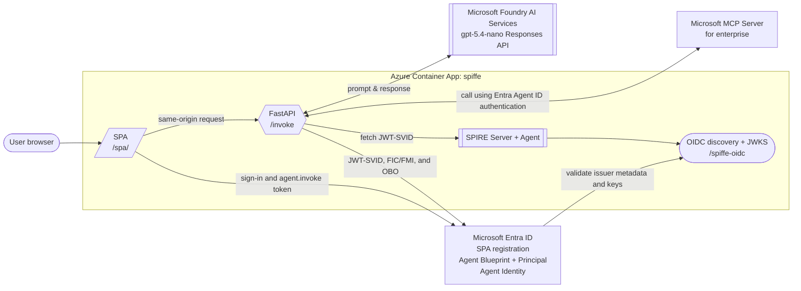

# SPIFFE JWT-SVID to Entra Agent ID POC

This proof of concept runs SPIRE Server, SPIRE Agent, the OIDC discovery
provider, FastAPI, and a browser SPA in one Azure Container App image.

> [!WARNING]
> SPIRE state is intentionally ephemeral. Every container start generates a new
> CA journal, signing key, and JWT `kid`. Microsoft Entra can cache federated
> issuer metadata and JWKS, so token exchange can fail after a restart until
> its cache refreshes. Do not use this architecture in production.

## Architecture



## Routes

| Purpose | Path |
|---|---|
| SPA | `/spa/` |
| Invoke API | `/invoke` |
| Liveness | `/healthz` |
| Readiness | `/readyz` |
| OIDC metadata | `/spiffe-oidc/.well-known/openid-configuration` |
| OIDC metadata, RFC 8414 form | `/.well-known/openid-configuration/spiffe-oidc` |
| JWKS | `/spiffe-oidc/keys` |

The SPA and API share one origin, so CORS and a separate API URL are not
required. FastAPI serves `src/spa/index.html` and `src/spa/app.js`, and
generates `/spa/env-config.js` dynamically from runtime settings.

## Configuration

Copy the single committed example:

```powershell
Copy-Item .env.example .env
```

The root `.env` is the source of truth for both local Docker and Azure:

- `ENTRA_TENANT_ID`
- `BLUEPRINT_CLIENT_ID`
- `AGENT_IDENTITY_CLIENT_ID`
- `SPA_CLIENT_ID`
- `DOWNSTREAM_SCOPE`
- `EXPECTED_DELEGATED_SCOPE`
- `MCP_SERVER_URL`
- `SPIFFE_JWT_AUDIENCE`
- `AGENT_MODE`
- `AZURE_OPENAI_ENDPOINT`
- `AZURE_OPENAI_DEPLOYMENT`
- `AI_AGENT_SYSTEM_PROMPT`

The backend derives:

- inbound token audience from `BLUEPRINT_CLIENT_ID`
- SPA Blueprint scope from `BLUEPRINT_CLIENT_ID` and
  `EXPECTED_DELEGATED_SCOPE`
- SPA API URL as `/invoke`
- SPA tenant from `ENTRA_TENANT_ID`

Compose derives the local issuer as `http://localhost:8000/spiffe-oidc`; Azure
derives it from the generated ACA origin and the same fixed path.

Before provisioning, the interactive AZD `preprovision` hook creates the Entra
objects when the generated IDs are absent, updates `.env`, and imports it into
the selected AZD environment. When all generated IDs are already present, it
reuses them and skips object creation. `infra/main.parameters.json` maps the
deployment values to required Bicep parameters. Azure computes and overrides
the public OIDC issuer with the generated ACA origin plus `/spiffe-oidc`.

## Entra Bootstrap

The normal Azure workflow does not require running the bootstrap separately.
`azd up` invokes it through `preprovision`. Run it directly only when creating
the Entra objects before local development:

```powershell
.\scripts\setup-entra.ps1 -TenantId "<tenant-id>"
```

The bootstrap creates `.env` from `.env.example` when needed and updates
`ENTRA_TENANT_ID`, `BLUEPRINT_CLIENT_ID`, `AGENT_IDENTITY_CLIENT_ID`,
`SPA_CLIENT_ID`, and `EXPECTED_DELEGATED_SCOPE`. Existing unrelated values are
preserved. Complete any remaining placeholders before deployment. The script
does not create a FIC because the public issuer is an Azure deployment output.

## AI Agent

FastAPI hosts the stateless agent loop using the Azure OpenAI Responses API.
The deployed `gpt-5.4-nano` model receives the configured system prompt and the
Microsoft MCP Server for enterprise as a native remote MCP tool. For each
request, the backend supplies the Agent Identity's user-scoped token as MCP
authorization. Only read scopes are granted in `DOWNSTREAM_SCOPE`.

Infrastructure deploys one keyless Microsoft Foundry `AIServices` resource and
one `gpt-5.4-nano` model deployment (`GlobalStandard`, version `2026-03-17`). A
model deployment is used instead of an implicit serverless endpoint because it
is the smallest deterministic Bicep contract and works directly with managed
identity. The Container App identity receives `Cognitive Services OpenAI User`;
no API key is enabled or stored.

`AI_AGENT_SYSTEM_PROMPT` is the tuning surface for the agent instructions.
Azure supplies `AZURE_OPENAI_ENDPOINT` and `AZURE_OPENAI_DEPLOYMENT` to the
Container App. For local Compose use after deployment, copy the endpoint from
`azd env get-value AZURE_OPENAI_ENDPOINT` into root `.env`.

## Local Run

```powershell
docker compose up --build --wait
```

Open <http://localhost:8000/spa/>.

The SPA app registration must include this local redirect URI:

```text
http://localhost:8000/spa/
```

Stop local resources:

```powershell
docker compose down --remove-orphans
```

## Azure Deployment

Select or create an AZD environment and set its Azure target:

```powershell
azd env new poc-spiffe --no-prompt
azd env set AZURE_SUBSCRIPTION_ID <subscription-id>
azd env set AZURE_LOCATION westeurope
azd env set AZURE_RESOURCE_GROUP ai-spiffe
```

Optionally run the complete preprovision phase independently. It can prompt for
Microsoft Graph sign-in and creates Entra objects when IDs are absent:

```powershell
azd hooks run preprovision
```

Deploy the complete workflow. ACR Tasks builds the image remotely:

```powershell
azd up
```

The `azd up` order is:

1. `preprovision`: bootstrap or reuse Entra objects, update `.env`, and import
  it into AZD.
2. Provision and deploy the Azure Container App.
3. `postdeploy`: add the generated SPA redirect, upsert the Blueprint FIC, and
  grant tenant-wide delegated permissions for the SPA and Agent Identity.

After deployment, the interactive `postdeploy` hook reads the generated AZD
outputs and updates Entra automatically. It preserves the local SPA redirect,
adds `SPA_URL`, and upserts the named Blueprint FIC from `FIC_ISSUER`,
`FIC_SUBJECT`, and `FIC_AUDIENCE`. It also grants the SPA `agent.invoke` on the
Blueprint and grants the Agent Identity the claim values from
`DOWNSTREAM_SCOPE`. The hook extracts the resource appId from those `api://`
scope URIs and queries Microsoft Graph for the tenant-local service principal
object ID before creating the grant. For Microsoft MCP Server for enterprise,
the well-known appId is `e8c77dc2-69b3-43f4-bc51-3213c9d915b4`. The Graph
context established during bootstrap is retained for this hook.

Inspect the generated values when troubleshooting:

```powershell
azd env get-values | Select-String 'FIC_ISSUER|FIC_SUBJECT|FIC_AUDIENCE|BACKEND_URL|SPA_URL'
```

Rerun only the Entra post-deployment configuration when needed:

```powershell
azd hooks run postdeploy
```

The hook is idempotent: it does not duplicate the SPA redirect URI and it
creates or updates the FIC named `spire-jwt-svid-blueprint` on the Blueprint
application, never on the Agent Identity. Matching delegated grants are reused;
new grants use a six-month expiry.

Remove the complete AZD-managed resource group:

```powershell
azd down --purge
```

After successful Azure teardown, the interactive `postdown` hook removes the Agent
Identity and its grants, the SPA principal/application and grants, and the
Blueprint. Blueprint deletion cascades to the Blueprint Principal and any
remaining child Agent Identities. It then resets the three generated client
IDs in root `.env`, allowing a later `azd up` to bootstrap fresh objects.

Microsoft Entra deletions are soft deletions and remain recoverable for 30
days. `--purge` removes the AZD-managed Azure environment; it does not hard
delete objects from the Entra recycle bin.

## Project Layout

```text
src/
  Dockerfile
  entrypoint.sh
  backend/
    main.py
    requirements.txt
    test_main.py
  spa/
    index.html
    app.js
  spire/
    server.conf
    agent.conf
    oidc-discovery-provider.conf
infra/
  main.bicep
  main.parameters.json
scripts/
  setup-entra.ps1
  configure-pre-deployment.ps1
  configure-postdeploy.ps1
  configure-postdown.ps1
.env.example
azure.yaml
docker-compose.yml
```

## Token Flow

1. The SPA signs in and requests the Blueprint's delegated `agent.invoke`
   scope.
2. It calls same-origin `/invoke` with the user access token.
3. The backend validates the token and exchanges its SPIFFE JWT-SVID for an FMI
   token scoped to the Agent Identity through `fmi_path`.
4. The Agent Identity performs the configured app-only or on-behalf-of exchange
  for the downstream read-only MCP scopes.
5. The backend sends the prompt, bounded conversation history, and Agent
  Identity MCP token to `gpt-5.4-nano` through the Responses API.
6. The model discovers and calls the enterprise MCP tools, then returns a final
  answer to the SPA.

The full JWT-SVID assertion is intentionally logged for troubleshooting.